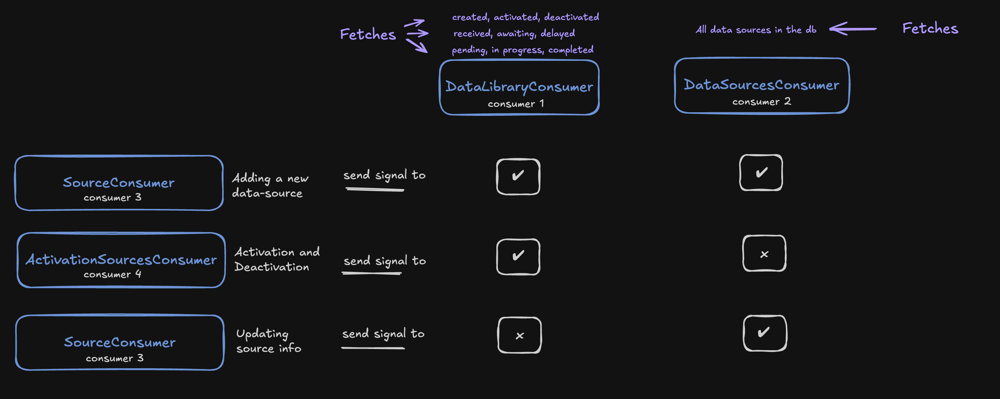

# Overview

This project is the backend application for marketplace-fe, https://github.com/Haabiy/marketplace-fe, a marketplace UI. It is built using Django, ensuring compatibility with marketplace-fe's API (use the same version release tags, e.g: v0.0.1 for both marketplace-fe(frontend) and marketplace-be(backend).



# Based on WebSocket Consumers

### DataLibraryConsumer

Manages the real-time display of data library metrics.

- **Group Name**: `DataLibrary`
- **Functions**:
  - `connect`: Joins the WebSocket group.
  - `disconnect`: Leaves the WebSocket group.
  - `fetch_data`: Retrieves and sends the latest data metrics.
  - `get_data`: Fetches data from the database (runs synchronously).

### ActivationSourcesConsumer

Handles activation, deactivation, and reactivation of sources.

- **Group Name**: `ToggleVisibility`
- **Functions**:
  - `connect`: Joins the WebSocket group.
  - `disconnect`: Leaves the WebSocket group.
  - `receive`: Processes activation-related actions.
  - `activate_source`: Activates a source.
  - `deactivate_source`: Deactivates a source.
  - `reactivate_source`: Reactivates a source.

### DataSourcesConsumer

Provides real-time updates of data sources.

- **Group Name**: `DataSource`
- **Functions**:
  - `connect`: Joins the WebSocket group.
  - `disconnect`: Leaves the WebSocket group.
  - `fetch_data_sources`: Retrieves and sends the latest data sources.
  - `get_data_sources`: Fetches data sources from the database (runs synchronously).

### SourceConsumer

Manages CRUD operations for sources.

- **Group Name**: `CRUDSource`
- **Functions**:
  - `connect`: Joins the WebSocket group.
  - `disconnect`: Leaves the WebSocket group.
  - `receive`: Processes CRUD-related actions.
  - `update_source`: Updates an existing source.
  - `add_source`: Adds a new source.

## Signals

Signals are used to notify WebSocket groups about data changes.

- **Signals**:
  - `crud`
  - `lib`
  - `source`
  - `toggle`
  - `source_lib`

- **Signal Receivers**:
  - `CRUDSourceSignal`: Handles CRUD operations.
  - `DataLibrarySignal`: Updates the data library.
  - `DataSourceSignal`: Updates data sources.
  - `DataSource_DataLibSignal`: Updates both data sources and library.
  - `ToggleVisibilitySignal`: Toggles source visibility.

## Installation

1. Clone the repository.
2. Install dependencies:
    ```bash
    pip install -r requirements.txt
    ```
3. Run the Django development server:
    ```bash
    python manage.py runserver
    ```

## Usage

1. Connect to the WebSocket endpoints for real-time updates.
2. Use the provided WebSocket consumers to manage data operations.
3. Signals will automatically update the connected clients upon data changes.


## Django Tips - Notification settings
sending updates whenever we make changes

```python
async def handle_data_update(self, event):
    await self.fetch_data_sources()
```
```python
if self.channel_layer:
    await self.channel_layer.group_send(
        'DataLibrary',
        {
            'type': 'handle_data_update',
            'message': ({ "type": "update data sources"})
        }
    )
    await self.channel_layer.group_send(
        'DataSource',
        {
            'type': 'handle_data_update',
            'message': ({ "type": "update data sources"})
        }
    )
await self.send(text_data=json.dumps(response))
```

## Django Tips - Model Fields

The default attribute in Django models sets the default value for a field when a new model instance is created and that field is not explicitly set. However, if the field is explicitly set to an empty value (e.g., an empty string) in the form data, the default value will not be applied. The default attribute only comes into play when the field is not present at all in the provided data.

```python
granularity = models.CharField(max_length=255, default='National')

```
